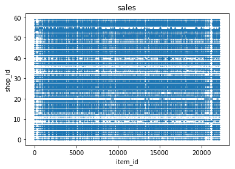
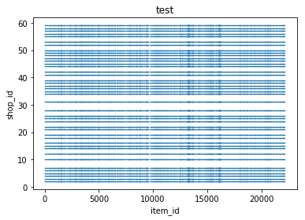
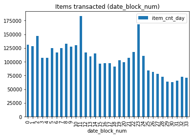

# Final project
_by Anders Pedersen_

[0. Introduction](#0)  
[1. EDA](#1)  
[2. Data Cleaning](#2)  
[3. Aggregate data and mean encoding](#3)  
[4. Time series LAG](#4)  
[5. Feature engineering](#5)  
[6. Data leakage search](#6)  
[7. Data clipping](#7)  
[8. Validation](#8)  
[9. Training](#9)  
[10. Predict](#10)  
[11. Conclusion and metric evaluation](#11)  

<!-- toc -->

# 0. Introduction <a name='0'></a>

This competition contains a time-series dataset consisting of daily sales data, from the Russian software firms - 1C Company hosted on Kaggle Inclass found __[here](https://www.kaggle.com/c/competitive-data-science-final-project)__.
The challenge is to predict total sales for every (shop, item) combination in the next month (item_cnt_month).  

This means that we will at some point need to aggregate our training data on (shop, item) combinations per month.  

The column *'date_block_num'* is a consecutive month number. Jan 2013 is 0, Feb 2013 is 1 etc.
The training set runs from Jan 2013 (date_block_num=0) to Oct 2015 (date_block_num=33) and the challenge is hence to predict the sales for Nov 2015 (date_block_num=34).


```python
import pandas as pd
import numpy as np
import matplotlib.pyplot as plt
import xgboost as xgb
import pickle
from IPython.core.interactiveshell import InteractiveShell
from multiprocessing import Pool
from itertools import product
from sklearn import preprocessing
InteractiveShell.ast_node_interactivity = "all"
%matplotlib inline
```


```python
test = pd.read_csv('test.csv')
shop = pd.read_csv('shops.csv')
submission = pd.read_csv('sample_submission.csv')
sales = pd.read_csv('sales_train.csv')
items = pd.read_csv('items.csv')
item_category = pd.read_csv('item_categories.csv')
```

### Grid for restructuring
We have to restructure train data to match the test data generation.  
To do this we create a 'master' grid.


```python
index_cols = ['shop_id', 'item_id', 'date_block_num']
grid = []
for block_num in sales['date_block_num'].unique():
    cur_shops = sales.loc[sales['date_block_num'] == block_num, 'shop_id'].unique()
    cur_items = sales.loc[sales['date_block_num'] == block_num, 'item_id'].unique()
    grid.append(np.array(list(product(*[cur_shops, cur_items, [block_num]])),dtype='int32'))
grid = pd.DataFrame(np.vstack(grid), columns = index_cols,dtype=np.int32)
```

# 1. EDA <a name='1'></a>

### General characteristics of the training and test sets
The sales dataframe have 2935849 rows and 6 colums.  
The row 'item_cnt_day' is the number we will aggregate and use as our labelled data.


```python
sales.shape
```


    (2935849, 6)


```python
sales.head(1)
```


<div>
<style scoped>
    .dataframe tbody tr th:only-of-type {
        vertical-align: middle;
    }

    .dataframe tbody tr th {
        vertical-align: top;
    }

    .dataframe thead th {
        text-align: right;
    }
</style>
<table border="1" class="dataframe">
  <thead>
    <tr style="text-align: right;">
      <th></th>
      <th>date</th>
      <th>date_block_num</th>
      <th>shop_id</th>
      <th>item_id</th>
      <th>item_price</th>
      <th>item_cnt_day</th>
    </tr>
  </thead>
  <tbody>
    <tr>
      <th>0</th>
      <td>02.01.2013</td>
      <td>0</td>
      <td>59</td>
      <td>22154</td>
      <td>999.0</td>
      <td>1.0</td>
    </tr>
  </tbody>
</table>
</div>


```python
test.shape
```


    (214200, 3)


```python
test.head(1)
```


<div>
<style scoped>
    .dataframe tbody tr th:only-of-type {
        vertical-align: middle;
    }

    .dataframe tbody tr th {
        vertical-align: top;
    }

    .dataframe thead th {
        text-align: right;
    }
</style>
<table border="1" class="dataframe">
  <thead>
    <tr style="text-align: right;">
      <th></th>
      <th>ID</th>
      <th>shop_id</th>
      <th>item_id</th>
    </tr>
  </thead>
  <tbody>
    <tr>
      <th>0</th>
      <td>0</td>
      <td>5</td>
      <td>5037</td>
    </tr>
  </tbody>
</table>
</div>


```python
submission.head(1)
```


<div>
<style scoped>
    .dataframe tbody tr th:only-of-type {
        vertical-align: middle;
    }

    .dataframe tbody tr th {
        vertical-align: top;
    }

    .dataframe thead th {
        text-align: right;
    }
</style>
<table border="1" class="dataframe">
  <thead>
    <tr style="text-align: right;">
      <th></th>
      <th>ID</th>
      <th>item_cnt_month</th>
    </tr>
  </thead>
  <tbody>
    <tr>
      <th>0</th>
      <td>0</td>
      <td>0.5</td>
    </tr>
  </tbody>
</table>
</div>


One observation here is that if the test set (representing Nov 2015) was similar to an average month of the sales set it should contain around 2935847/33 = 89000 rows. Instead it contains over 200000 rows.  

It turns out that the test set contains all combinations of 42 unique 'shop_id' values and 5100 unique 'item_id' values which corresponds to 42 * 5100 = 214200 rows.  
  
The sales set contains both more unique 'shop_id' values and unique 'item_id' values.


```python
test.groupby(['shop_id']).count().head(4)
```


<div>
<style scoped>
    .dataframe tbody tr th:only-of-type {
        vertical-align: middle;
    }

    .dataframe tbody tr th {
        vertical-align: top;
    }

    .dataframe thead th {
        text-align: right;
    }
</style>
<table border="1" class="dataframe">
  <thead>
    <tr style="text-align: right;">
      <th></th>
      <th>ID</th>
      <th>item_id</th>
    </tr>
    <tr>
      <th>shop_id</th>
      <th></th>
      <th></th>
    </tr>
  </thead>
  <tbody>
    <tr>
      <th>2</th>
      <td>5100</td>
      <td>5100</td>
    </tr>
    <tr>
      <th>3</th>
      <td>5100</td>
      <td>5100</td>
    </tr>
    <tr>
      <th>4</th>
      <td>5100</td>
      <td>5100</td>
    </tr>
    <tr>
      <th>5</th>
      <td>5100</td>
      <td>5100</td>
    </tr>
  </tbody>
</table>
</div>


```python
print('shop_id count (train/test):',sales['shop_id'].nunique(),'/',test['shop_id'].nunique(),
      '\nitem_id count (train/test):',sales['item_id'].nunique(),'/',test['item_id'].nunique())
```

    shop_id count (train/test): 60 / 42 
    item_id count (train/test): 21807 / 5100


It turns out that all test 'shop_id' values are included in the sales set. However:  
**There are 363 (out of 5100) unique 'item_id' values in the test set that are not represented in the sales set.**


```python
print('All shop_id included?',test['shop_id'].isin(sales['shop_id']).all())
print('All item_id included?',test['item_id'].isin(sales['item_id']).all())
```

    All shop_id included? True
    All item_id included? False


```python
not_in_sales = []
list = np.sort(sales['item_id'].unique())
for i in test['item_id'].unique():
    if not (i in list):
        not_in_sales.append(i)
print('test item_id values not included in sales set:',len(not_in_sales))
```

    test item_id values not included in sales set: 363


It also turns out that the training set is composed as follows:  
**Only items sold in a particular month are included in the sales set.**


```python
sales.groupby(['date_block_num','shop_id','item_id'])['shop_id','date_block_num','item_id'].count().head(4)
```


<div>
<style scoped>
    .dataframe tbody tr th:only-of-type {
        vertical-align: middle;
    }

    .dataframe tbody tr th {
        vertical-align: top;
    }

    .dataframe thead th {
        text-align: right;
    }
</style>
<table border="1" class="dataframe">
  <thead>
    <tr style="text-align: right;">
      <th></th>
      <th></th>
      <th></th>
      <th>shop_id</th>
      <th>date_block_num</th>
      <th>item_id</th>
    </tr>
    <tr>
      <th>date_block_num</th>
      <th>shop_id</th>
      <th>item_id</th>
      <th></th>
      <th></th>
      <th></th>
    </tr>
  </thead>
  <tbody>
    <tr>
      <th rowspan="4" valign="top">0</th>
      <th rowspan="4" valign="top">0</th>
      <th>32</th>
      <td>4</td>
      <td>4</td>
      <td>4</td>
    </tr>
    <tr>
      <th>33</th>
      <td>3</td>
      <td>3</td>
      <td>3</td>
    </tr>
    <tr>
      <th>35</th>
      <td>1</td>
      <td>1</td>
      <td>1</td>
    </tr>
    <tr>
      <th>43</th>
      <td>1</td>
      <td>1</td>
      <td>1</td>
    </tr>
  </tbody>
</table>
</div>


Creating scatter plots of the sales and test datasets confirms this picture


```python
sales.plot.scatter('item_id', 'shop_id', s = 0.01, title='sales')
test.plot.scatter('item_id', 'shop_id', s = 0.01, title='test')
```


    <matplotlib.axes._subplots.AxesSubplot at 0x7f6ceff81240>


    <matplotlib.axes._subplots.AxesSubplot at 0x7f6cf160b470>








### Time trends
Observing the data there seems to be some proof of peroidic behavior, e.g. it seems the sales are high around new year


```python
sales.groupby('date_block_num').agg({"item_cnt_day": "sum"}).plot.bar(title="Items transacted (date_block_num)")
```


    <matplotlib.axes._subplots.AxesSubplot at 0x7f6cf15ab4e0>





This confirms the validity of introducing time-based features.  
Added to the periodicities mentioned above we a also see an overall trend of sales diminishing.

# 2. Data cleaning <a name='2'></a>

Observing the values for 'item_price' and 'item_cnt_day' it looks like we have some erroneous data.  
Hence a bit of cleaning is applied.


```python
for col in ['item_price', 'item_cnt_day']:
    print('column:',col,'- min:',sales[col].min(),'- max:',sales[col].max(),'- mean:',sales[col].mean())
```

    column: item_price - min: -1.0 - max: 307980.0 - mean: 890.8532326979881
    column: item_cnt_day - min: -22.0 - max: 2169.0 - mean: 1.242640885140891


```python
sales = sales[sales.item_price<100000]
sales = sales[sales.item_cnt_day<=900]
```

Let's check for missing values. It turns out we're fine.


```python
sales.isnull().sum(axis = 0)
```


    date              0
    date_block_num    0
    shop_id           0
    item_id           0
    item_price        0
    item_cnt_day      0
    dtype: int64


# 3. Aggregate data and mean encoding <a name='3'></a>

As seen above the test set requires us to predict monthly sales. Hence we need to aggregate the sales data to montly level before proceding


```python
sales_m = sales.groupby(['date_block_num','shop_id','item_id']).agg({'item_cnt_day': 'sum','item_price': np.mean}).reset_index()
sales_m = pd.merge(grid,sales_m,on=['date_block_num','shop_id','item_id'],how='left').fillna(0)
```

Further join our sales data frame with the item and item category data frames to include more item features


```python
sales_m = pd.merge(sales_m,items,on=['item_id'],how='left')
sales_m = pd.merge(sales_m,item_category, on=['item_category_id'], how='left')
```

And then perform mean encoding on all category data which are item_id, shop_id and item_category_id.
In total 9 new features are created:
'item_id_avg_item_price', 'item_id_sum_item_cnt_day', 'item_id_avg_item_cnt_day', 'shop_id_avg_item_price', 'shop_id_sum_item_cnt_day', 'shop_id_avg_item_cnt_day', 'item_category_id_avg_item_price', 'item_category_id_sum_item_cnt_day', 'item_category_id_avg_item_cnt_day

We then perform mean encoding on all category data which are item_id, shop_id and item_category_id


```python
for type_id in ['item_id','shop_id','item_category_id']:
    for column_id, agg_func, func_name in [('item_price',np.mean,'avg'),('item_cnt_day',np.sum,'sum'),('item_cnt_day',np.mean,'avg')]:
        mean_df = sales_m.groupby([type_id,'date_block_num']).agg(agg_func).reset_index()[[column_id,type_id,'date_block_num']]
        mean_df.columns = [type_id+'_'+func_name+'_'+column_id, type_id,'date_block_num']
        sales_m = pd.merge(sales_m,mean_df,on=['date_block_num', type_id],how='left')
```


```python
sales_m.head(1)
```


<div>
<style scoped>
    .dataframe tbody tr th:only-of-type {
        vertical-align: middle;
    }

    .dataframe tbody tr th {
        vertical-align: top;
    }

    .dataframe thead th {
        text-align: right;
    }
</style>
<table border="1" class="dataframe">
  <thead>
    <tr style="text-align: right;">
      <th></th>
      <th>shop_id</th>
      <th>item_id</th>
      <th>date_block_num</th>
      <th>item_cnt_day</th>
      <th>item_price</th>
      <th>item_name</th>
      <th>item_category_id</th>
      <th>item_category_name</th>
      <th>item_id_avg_item_price</th>
      <th>item_id_sum_item_cnt_day</th>
      <th>item_id_avg_item_cnt_day</th>
      <th>shop_id_avg_item_price</th>
      <th>shop_id_sum_item_cnt_day</th>
      <th>shop_id_avg_item_cnt_day</th>
      <th>item_category_id_avg_item_price</th>
      <th>item_category_id_sum_item_cnt_day</th>
      <th>item_category_id_avg_item_cnt_day</th>
    </tr>
  </thead>
  <tbody>
    <tr>
      <th>0</th>
      <td>59</td>
      <td>22154</td>
      <td>0</td>
      <td>1.0</td>
      <td>999.0</td>
      <td>ЯВЛЕНИЕ 2012 (BD)</td>
      <td>37</td>
      <td>Кино - Blu-Ray</td>
      <td>310.8</td>
      <td>18.0</td>
      <td>0.4</td>
      <td>97.974472</td>
      <td>2017.0</td>
      <td>0.248552</td>
      <td>63.014719</td>
      <td>6094.0</td>
      <td>0.199738</td>
    </tr>
  </tbody>
</table>
</div>


# 4. Time series LAG <a name='4'></a>

We will introduce LAG features i.e. use of prior time steps to predict the next time step.

We first append test data into sales data.  
This is needed in order for us to create lag features on them.


```python
temp_copy = test.copy()
temp_copy['date_block_num'] = 34
temp_copy.drop('ID', axis=1, inplace=True)
temp_copy = temp_copy.merge(items, how='left', on='item_id')
temp_copy = temp_copy.merge(item_category, how='left', on='item_category_id')
temp_copy.drop('item_name', axis=1, inplace=True)
sales_m.drop('item_name', axis=1, inplace=True)
sales_m = pd.concat([sales_m,temp_copy], axis=0, ignore_index=True)
```

    /opt/conda/lib/python3.6/site-packages/ipykernel_launcher.py:8: FutureWarning: Sorting because non-concatenation axis is not aligned. A future version
    of pandas will change to not sort by default.
    
    To accept the future behavior, pass 'sort=True'.
    
    To retain the current behavior and silence the warning, pass sort=False
    
      


We create lags on 10 features. 9 features are from mean encoding and 1 feature is the item_cnt_day.

After several tries, we found that month lag intervals of 1, 2, 3, 4, 5, 6, 9 and 12 give best score in the leaderboard. Take note that 16GB of ram is unable to compute such large number of interval. We need at least 64GB of ram. 


```python
lag_variables  = ['item_id_avg_item_price','item_id_sum_item_cnt_day','item_id_avg_item_cnt_day',
'shop_id_avg_item_price','shop_id_sum_item_cnt_day','shop_id_avg_item_cnt_day','item_category_id_avg_item_price',
'item_category_id_sum_item_cnt_day','item_category_id_avg_item_cnt_day','item_cnt_day']

# More lags (longer back in time) might produce better result
# I've limited this in order to fit data frame into memory
lags = [1,2,3]

for lag in lags:
    sales_new_df = sales_m.copy()
    sales_new_df.date_block_num+=lag
    sales_new_df = sales_new_df[['date_block_num','shop_id','item_id']+lag_variables]
    sales_new_df.columns = ['date_block_num','shop_id','item_id']+ [lag_feat+'_lag_'+str(lag) for lag_feat in lag_variables]
    sales_m = sales_m.merge(sales_new_df,on=['date_block_num','shop_id','item_id'] ,how='left')
```


```python
sales_m.head(1)
```


<div>
<style scoped>
    .dataframe tbody tr th:only-of-type {
        vertical-align: middle;
    }

    .dataframe tbody tr th {
        vertical-align: top;
    }

    .dataframe thead th {
        text-align: right;
    }
</style>
<table border="1" class="dataframe">
  <thead>
    <tr style="text-align: right;">
      <th></th>
      <th>date_block_num</th>
      <th>item_category_id</th>
      <th>item_category_id_avg_item_cnt_day</th>
      <th>item_category_id_avg_item_price</th>
      <th>item_category_id_sum_item_cnt_day</th>
      <th>item_category_name</th>
      <th>item_cnt_day</th>
      <th>item_id</th>
      <th>item_id_avg_item_cnt_day</th>
      <th>item_id_avg_item_price</th>
      <th>...</th>
      <th>item_id_avg_item_price_lag_3</th>
      <th>item_id_sum_item_cnt_day_lag_3</th>
      <th>item_id_avg_item_cnt_day_lag_3</th>
      <th>shop_id_avg_item_price_lag_3</th>
      <th>shop_id_sum_item_cnt_day_lag_3</th>
      <th>shop_id_avg_item_cnt_day_lag_3</th>
      <th>item_category_id_avg_item_price_lag_3</th>
      <th>item_category_id_sum_item_cnt_day_lag_3</th>
      <th>item_category_id_avg_item_cnt_day_lag_3</th>
      <th>item_cnt_day_lag_3</th>
    </tr>
  </thead>
  <tbody>
    <tr>
      <th>0</th>
      <td>0</td>
      <td>37</td>
      <td>0.199738</td>
      <td>63.014719</td>
      <td>6094.0</td>
      <td>Кино - Blu-Ray</td>
      <td>1.0</td>
      <td>22154</td>
      <td>0.4</td>
      <td>310.8</td>
      <td>...</td>
      <td>NaN</td>
      <td>NaN</td>
      <td>NaN</td>
      <td>NaN</td>
      <td>NaN</td>
      <td>NaN</td>
      <td>NaN</td>
      <td>NaN</td>
      <td>NaN</td>
      <td>NaN</td>
    </tr>
  </tbody>
</table>
<p>1 rows × 46 columns</p>
</div>


A little cleanup before proceeding. Let's fill missing values


```python
for feat in sales_m.columns:
    if 'item_cnt' in feat:
        sales_m[feat]=sales_m[feat].fillna(0)
    elif 'item_price' in feat:
        sales_m[feat]=sales_m[feat].fillna(sales_m[feat].median())
```

# 5. Feature engineering <a name='5'></a>

To keep periodicity information in the dataset we'll add a 'month of year' indicator


```python
sales_m['date_block_mod'] = sales_m['date_block_num'] % 12
```

I have (offline) created the table <categories_en.csv> in two steps:
I took the table <item_categories.csv> and ran it through Google translate
I aggregated the values into super categories e.g. everything containing music is labelled 'Music' etc.
Example: item category name "Игровые консоли - PS2,10" is translated into "Game Consoles - PS2,10". All names containing the words ""Game Consoles" are then mapped to the category "Game Consoles" (stemming).


```python
#cat_en_df = pd.read_csv('./categories_en.csv')
#sales_m = pd.merge(sales_m, cat_en_df, left_on='item_category_id', right_on='item_category_id')
```

Similarly I have create the table <shops_en.csv> from the table <shops.csv> through Google translate and then applying stemming.  
Exampe: shop name 'Адыгея ТЦ Мега' is translated to 'Adygea Shopping Center Mega' which is the stemmed to 'Adygea'.


```python
#shops_en_df = pd.read_csv('./shops_en.csv')
#sales_m = pd.merge(sales_m, shops_en_df, left_on='shop_id', right_on='shop_id')
```

We need to encoder the new labels as numeric in order for XGBoost to handle then


```python
#sales_m['cat_en'] = sales_m['cat_en'].astype('category')
#sales_m['shop_en'] = sales_m['shop_en'].astype('category')
```


```python
#le = preprocessing.LabelEncoder()
#le = le.fit(sales_m['cat_en'])
#sales_m['cat_en_num'] = le.transform(sales_m['cat_en'])
#le = le.fit(sales_m['shop_en'])
#sales_m['shop_en_num'] = le.transform(sales_m['shop_en'])
#sales_m.head(1)
```

After test it turns out that adding 'cat_en' and 'shop_en' does not improve the score and they are henced omitted.

# 6. Validation <a name='6'></a>

### Train/test split
As we earlier saw an overall trend of sales diminishing over time
we will focus on the latest data available


```python
sales_m = sales_m[sales_m['date_block_num']>12]
```

As our dataset is time-based
and our test set is based on data after the train set
we use the last block in the series for validation (hold-out scheme).  
This is an acceptable strategy as we have sufficient data.

Now let's split the combined dataframe.  
Note that X_train includes both features and label column (y_train / item_cnt)


```python
cols_to_drop = lag_variables[:-1] + ['item_price']
X_train = sales_m[sales_m['date_block_num']<33].drop(cols_to_drop, axis=1)
X_cv =  sales_m[sales_m['date_block_num']==33].drop(cols_to_drop, axis=1)
X_test = sales_m[sales_m['date_block_num']==34].drop(cols_to_drop, axis=1)
```


```python
print('dimensions of X_train:',X_train.shape,'\ndimensions of X_cv:',X_cv.shape)
```

    dimensions of X_train: (5839576, 37) 
    dimensions of X_cv: (238172, 37)


### Public/private split
The test set contains 214200 rows.
The public and private test sets are both subsets of this combined test set.  
When we submit we can observe our score towards the public test set.


```python
print('dimensions of test:',test.shape,'\ndimsensions of X_test', X_test.shape)
```

    dimensions of test: (214200, 3) 
    dimsensions of X_test (214200, 37)


# 7. Data clipping <a name='7'></a>

Clip the item_cnt_day within 40 (from discussion in Kaggle forum)


```python
X_train['item_cnt_day'].clip_upper(40, inplace=True)
X_train['item_cnt_day'].clip_lower(0, inplace=True)
X_cv['item_cnt_day'].clip_upper(40, inplace=True)
X_cv['item_cnt_day'].clip_lower(0, inplace=True)
X_test['item_cnt_day'].clip_upper(40, inplace=True)
X_test['item_cnt_day'].clip_lower(0, inplace=True)
```

# 8. Data leakage search <a name='8'></a>

I did not find hidden information in the test set 'ID' column:


```python
test['ID'].head()
```


    0    0
    1    1
    2    2
    3    3
    4    4
    Name: ID, dtype: int64


There does not seem to be any out-of-date (look into the future) information in the sales set


```python
np.sort(sales['date'].unique())
```


    array(['01.01.2013', '01.01.2014', '01.01.2015', ..., '31.10.2015',
           '31.12.2013', '31.12.2014'], dtype=object)


What about row order in test set?
It seems like there is no hidden information here.  
The values in the columns 'shop_id' and 'item_id' are shuffled and then combined.


```python
for i in range(0,2):
    for j in range(0,2):
        print(test.iloc[[i*5100+j]])
```

       ID  shop_id  item_id
    0   0        5     5037
       ID  shop_id  item_id
    1   1        5     5320
            ID  shop_id  item_id
    5100  5100        4     5037
            ID  shop_id  item_id
    5101  5101        4     5320


So no data leaks found in my search.

# 9. Training <a name='9'></a>

Now let's train a model using XGBoost


```python
params = {
        'eta': 0.08,
        'max_depth': 7,
        'objective': 'reg:linear',
        'eval_metric': 'rmse',
        'seed': 3,
        'gamma':1,
        'silent': True
    }
```


```python
cols = [c for c in X_train.columns if c not in ['date_block_num', 'item_cnt_day','item_category_name']]
x1 = X_train[cols]
y1 = X_train['item_cnt_day']
x2 = X_cv[cols]
y2 = X_cv['item_cnt_day']
watchlist = [(xgb.DMatrix(x1, y1), 'train'), (xgb.DMatrix(x2, y2), 'valid')]
model = xgb.train(params, xgb.DMatrix(x1, y1), 3500,  watchlist, maximize=False, verbose_eval=50, early_stopping_rounds=50)
```

    [11:52:00] Tree method is automatically selected to be 'approx' for faster speed. to use old behavior(exact greedy algorithm on single machine), set tree_method to 'exact'
    [0]	train-rmse:1.40522	valid-rmse:1.37906
    Multiple eval metrics have been passed: 'valid-rmse' will be used for early stopping.
    
    Will train until valid-rmse hasn't improved in 50 rounds.
    [50]	train-rmse:1.02193	valid-rmse:1.14896
    [100]	train-rmse:0.985907	valid-rmse:1.14447
    [150]	train-rmse:0.961827	valid-rmse:1.14761
    Stopping. Best iteration:
    [102]	train-rmse:0.985336	valid-rmse:1.14439
    


# 10. Predict <a name='10'></a>

Now let's take the model and use it on the test set in order to create a set of predictions.  
Clip the item_cnt_day within 20 (from discussion in Kaggle forum)


```python
pred = model.predict(xgb.DMatrix(X_test[cols]), ntree_limit=model.best_ntree_limit)
test['item_cnt_month'] = pred.clip(0,20)
test.drop(['shop_id', 'item_id'], axis=1, inplace=True)
```

### Save predictions
Let's save the predictions to disc in order to submit them on coursera.org


```python
test.to_csv('submission.csv', index=False)
```

# 11. Conclusion and metric evaluation <a name='11'></a>

Submitting the prediction above gives
-  public leaderboard score: 0.961135
-  private leaderboard score: 0.969740

This result have an acceptable RMSE loss.  
Also we haven't overfitted towards the public leaderboard (results are not to wide apart).
